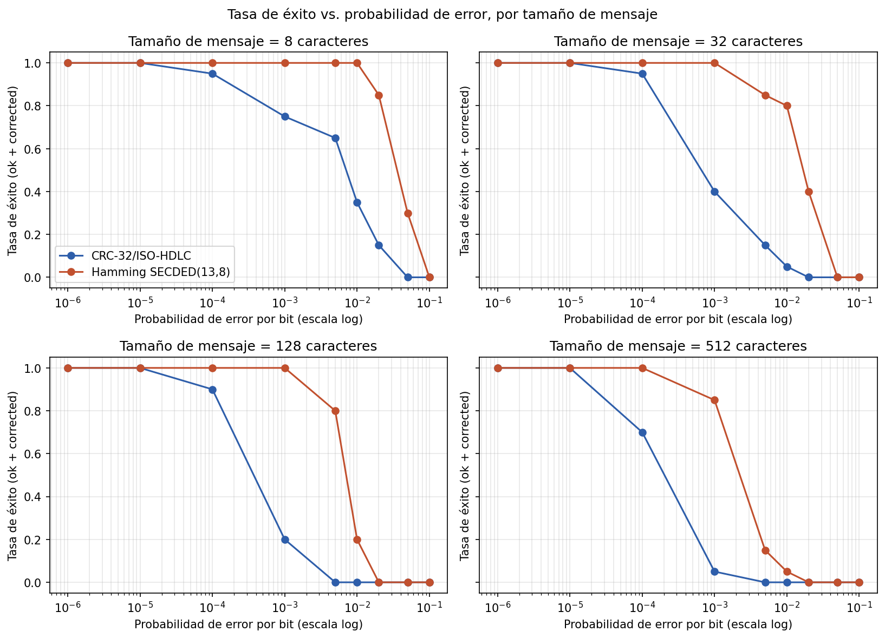
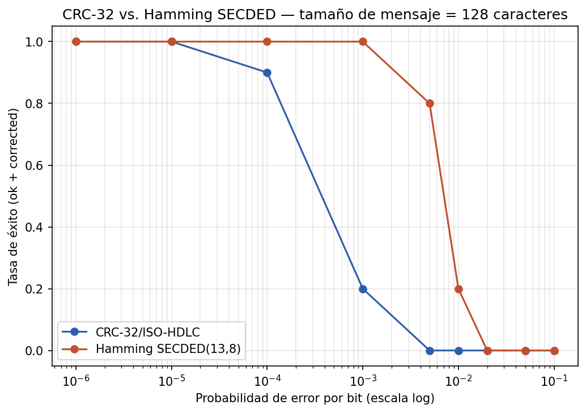
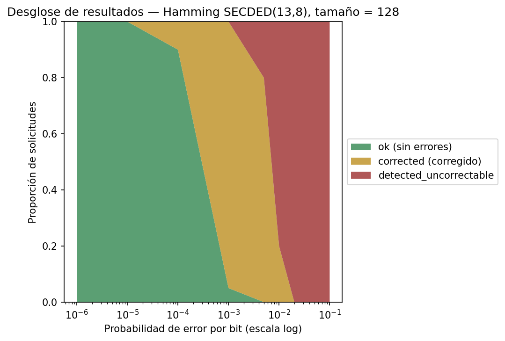
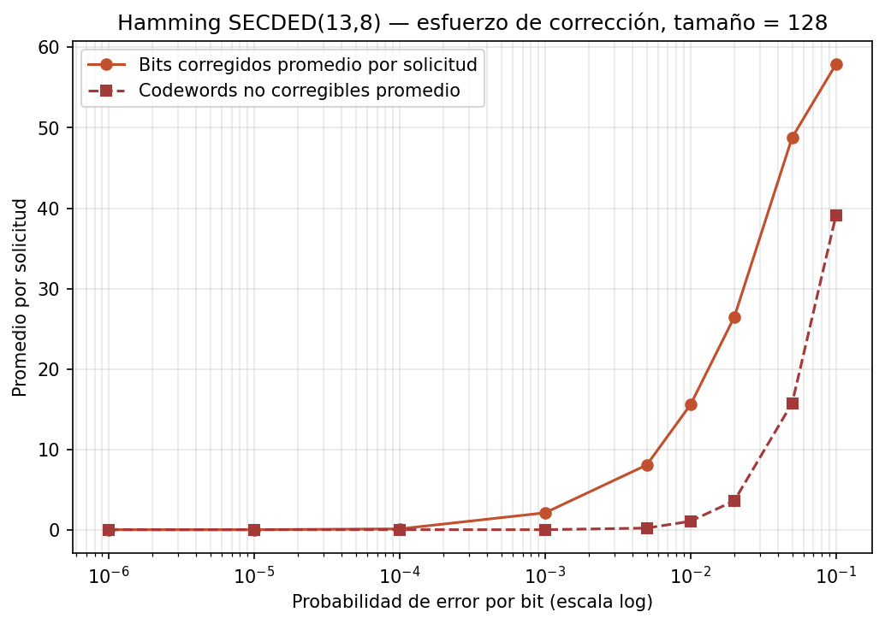
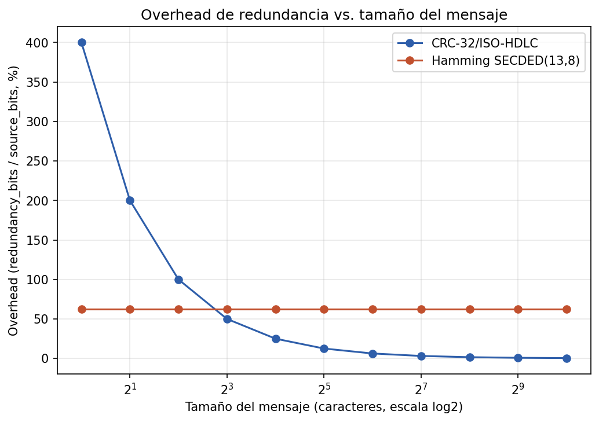

\newpage

# Nombres y carnés

- COMPLETAR NOMBRE COMPLETO -- Carné 23663
- COMPLETAR NOMBRE COMPLETO -- Carné COMPLETAR

Repositorio del proyecto: <https://github.com/Jonialen/lab2>

# Título de la práctica

Laboratorio \#2 -- Esquemas de detección y corrección de errores: implementación de una arquitectura de capas con CRC-32/ISO-HDLC y Hamming SECDED(13,8) sobre un canal simulado no confiable.

# Descripción de la práctica

## Objetivo y alcance

Toda comunicación digital está expuesta a ruido: un medio físico puede alterar bits individuales durante la transmisión. La capa de Enlace es responsable de ofrecer mecanismos que permitan **detectar** —y, cuando sea posible, **corregir**— esas alteraciones antes de que el mensaje llegue a capas superiores. En este laboratorio se implementó una aplicación cliente-servidor completa que:

1. Solicita un mensaje de texto y un algoritmo de integridad al usuario.
2. Codifica el mensaje en ASCII binario.
3. Calcula la información de integridad correspondiente al algoritmo elegido (CRC-32 o Hamming SECDED) y la concatena al mensaje.
4. Aplica ruido determinista, bit a bit, con una probabilidad de error configurable.
5. Transmite la trama resultante por un socket TCP hacia un receptor que escucha de forma persistente.
6. En el receptor, verifica la integridad, corrige si el algoritmo lo permite, decodifica y muestra el mensaje o un mensaje de error.

Siguiendo el requisito de la asignación, el emisor y el receptor están implementados en **lenguajes distintos**: el emisor en **Rust** y el receptor en **Go**. Ambos programas se comunican exclusivamente mediante el contrato de red descrito en `protocol/wire-protocol.md`, que define un objeto JSON por línea (NDJSON) sobre TCP/IPv4.

## Arquitectura de capas

| Capa | Responsabilidad | Dónde vive |
|---|---|---|
| Aplicación | Solicitar mensaje y algoritmo; mostrar el mensaje o el error | CLI interactiva del emisor (Rust) / respuesta estructurada del receptor (Go) |
| Presentación | Codificar cada carácter en ASCII de 8 bits, MSB primero; decodificar y validar ASCII imprimible | `ascii.rs` (emisor) / reconstrucción de octetos en el receptor (Go) |
| Enlace | Calcular integridad (CRC-32 o Hamming), concatenarla al mensaje binario, verificar y corregir en el receptor | `crc.rs` / `hamming.rs` (emisor); `crc.go` / `hamming.go` (receptor) |
| Ruido | Aplicar bit-flips independientes con probabilidad configurable, incluyendo los bits de redundancia | `noise.rs` (solo en el emisor, antes de serializar la trama) |
| Transmisión | Enviar y recibir la trama por un socket TCP en el puerto elegido | `main.rs` (emisor) / `server.go` (receptor, escucha persistente) |

La capa de Ruido no es una capa protocolar real: se modela como un paso adicional del lado del emisor, después de que la capa de Enlace produce la trama binaria completa (mensaje + redundancia) y antes de serializarla como JSON. El receptor nunca vuelve a aplicar ruido; solo confía en los bits ya alterados que recibe (`frame_bits`), tal como exige el enunciado.

## Algoritmos implementados

**CRC-32/ISO-HDLC (detección).** Se calcula el CRC-32 estándar (polinomio `0x04C11DB7`, registro inicial `0xFFFFFFFF`, entrada y salida reflejadas, XOR final `0xFFFFFFFF`) sobre los octetos ASCII originales. La trama transmitida es `payload_bits || crc_bits` (32 bits de redundancia, sin importar la longitud del mensaje). El receptor recalcula el CRC sobre el payload recibido y lo compara; si no coincide, el error se **detecta** pero no puede corregirse.

**Hamming SECDED(13,8) (corrección).** Cada octeto ASCII se codifica de forma independiente en una palabra de 13 bits: 4 bits de paridad de Hamming (posiciones 1, 2, 4, 8), 8 bits de datos y 1 bit de paridad global (posición 13) que habilita la corrección de un bit y la detección de dos (Single Error Correction, Double Error Detection). En el receptor se recalculan los cuatro chequeos de paridad para obtener un síndrome de 0 a 15 y se compara la paridad global; según la tabla de la sección 6 del protocolo, esto permite distinguir entre "sin error", "un bit corregible" y "doble error detectado pero no corregible".

## Protocolo de red

El contrato de red (`protocol/wire-protocol.md`) fija exactamente los campos de la solicitud (`protocol_version`, `request_id`, `algorithm`, `source_octets`, `frame_bits`, `noise`) y de la respuesta (`status`, `message`, `error`, `metrics`), de modo que emisor y receptor —escritos en lenguajes distintos— queden desacoplados por un contrato explícito y verificable, en vez de compartir estructuras de lenguaje. El generador de ruido determinista (SplitMix64, sembrado con un `seed` de 64 bits) permite reproducir exactamente los mismos bit-flips en experimentos repetidos, lo cual es la base de la metodología de pruebas de la sección 4.

## Verificación de la implementación

Antes de ejecutar los experimentos se confirmó que la implementación es correcta y reproducible:

- `go vet` y `gofmt` sin advertencias; `cargo fmt --check` y `cargo clippy -- -D warnings` sin advertencias.
- Suite de pruebas del receptor (`go test ./...`): pruebas unitarias de CRC y Hamming contra vectores normativos, pruebas de protocolo (JSON hostil, claves duplicadas/desconocidas, líneas demasiado largas, múltiples solicitudes por conexión) y una prueba de integración real que ejecuta el binario de Rust contra un servidor Go en proceso.
- Suite de pruebas del emisor (`cargo test`): validación de ASCII, vectores normativos de CRC-32 y Hamming, y del generador de ruido SplitMix64.
- Ejecución manual del lanzador conjunto (`scripts/run-lab.sh`) para el caso normativo de Hamming con ruido y para un caso limpio de CRC, confirmando que el sistema extremo a extremo funciona sobre un socket TCP real.

Todas las pruebas pasaron sin modificaciones al código de producción.

# Resultados

## Metodología experimental

Las pruebas se automatizaron con un script (`experiments/run_experiments.py`) que construye y levanta el receptor real de Go, y para cada caso invoca el binario real de Rust como cliente contra ese receptor por TCP —es decir, cada fila de datos es una ejecución genuina de la implementación, no una simulación aparte. Se varió:

- **Tamaño del mensaje**: 8, 32, 128 y 512 caracteres ASCII imprimibles (barrido principal), y adicionalmente 1, 2, 4, ..., 1024 caracteres para aislar el efecto del tamaño sobre el overhead.
- **Algoritmo**: CRC-32/ISO-HDLC y Hamming SECDED(13,8).
- **Probabilidad de error por bit**: 0, $10^{-5}$, $10^{-4}$, $10^{-3}$, $5\times10^{-3}$, $10^{-2}$, $2\times10^{-2}$, $5\times10^{-2}$ y $10^{-1}$.
- **Repeticiones**: 20 semillas distintas (0 a 19) por cada combinación de tamaño × algoritmo × probabilidad, para estimar una tasa de éxito con algo de significancia estadística.

En total se ejecutaron **1,462 solicitudes** reales, registradas sin editar en `experiments/data/raw_results.csv` (dataset crudo). A partir de ese archivo se generó `experiments/data/summary_by_probability.csv` (tasas agregadas por combinación) y `experiments/data/summary_overhead.csv` (overhead por tamaño), ambos derivados y conservados por separado del dataset crudo, junto con las figuras en `experiments/figures/`.

Para cada solicitud se registró el estado devuelto por el receptor (`ok`, `corrected`, `detected_uncorrectable`), las métricas de la sección 3 del protocolo (bits recibidos, de fuente, de redundancia, bits corregidos, unidades detectadas/no corregibles) y si el mensaje decodificado coincidía exactamente con el mensaje original enviado (lo cual permite detectar corrupciones **silenciosas**, es decir, casos donde el receptor reporta éxito pero el contenido en realidad cambió).

## Tasa de éxito según probabilidad de error y tamaño del mensaje

Para los cuatro tamaños de mensaje, Hamming SECDED mantiene una tasa de éxito de 100% en un rango de probabilidades más amplio que CRC-32, y su caída ocurre en probabilidades entre 5 y 10 veces mayores que las que ya degradan a CRC-32. Esto es consistente con la teoría: Hamming puede **corregir** cualquier error de un solo bit por octeto, mientras que CRC-32 solo **detecta** y nunca corrige, por lo que cualquier bit alterado en un mensaje resulta en `detected_uncorrectable`.

También se observa que, a una probabilidad de error fija, los mensajes más largos fallan con mayor frecuencia: con más bits transmitidos hay más oportunidades de que ocurra al menos un error. Por ejemplo, a $p = 10^{-3}$, CRC-32 tiene una tasa de éxito de 0.75 con mensajes de 8 caracteres pero de solo 0.05 con mensajes de 512 caracteres.

## Comparación directa a un tamaño representativo

Con mensajes de 128 caracteres (1,024 bits de payload), CRC-32 empieza a perder tasa de éxito ya en $p = 10^{-4}$ (90%) y cae a 0% en $p = 5\times10^{-3}$; Hamming SECDED mantiene 100% hasta $p = 10^{-3}$ y no llega a 0% hasta $p = 2\times10^{-2}$, casi un orden de magnitud después.

## Desglose de resultados de Hamming SECDED

Este gráfico separa la tasa de éxito de Hamming en sus dos componentes: mensajes que llegaron limpios (`ok`) y mensajes que llegaron con errores pero fueron corregidos (`corrected`). La banda `corrected` crece de forma sostenida entre $p = 10^{-4}$ y $p = 10^{-2}$, mostrando que buena parte del rango "seguro" de Hamming no es porque no haya errores, sino porque el algoritmo los está corrigiendo activamente.

## Esfuerzo de corrección

El número promedio de bits corregidos por solicitud crece de forma aproximadamente lineal con la probabilidad de error hasta $p \approx 10^{-2}$, y luego el número de codewords no corregibles (dos o más errores en el mismo octeto de 13 bits) empieza a crecer más rápido, lo que explica la caída final de la tasa de éxito observada en la sección 4.3.

## Overhead según el tamaño del mensaje

| Tamaño del mensaje | Overhead CRC-32 | Overhead Hamming SECDED |
|---:|---:|---:|
| 8 caracteres | 50.0% | 62.5% |
| 32 caracteres | 12.5% | 62.5% |
| 128 caracteres | 3.125% | 62.5% |
| 512 caracteres | 0.78% | 62.5% |
| 1024 caracteres | 0.39% | 62.5% |

El overhead de Hamming SECDED es **constante** en 62.5% (5 bits de redundancia por cada 8 bits de datos), independientemente del tamaño del mensaje, porque cada octeto se codifica de forma independiente. El overhead de CRC-32, en cambio, es **fijo en bits absolutos** (siempre 32 bits) pero decrece drásticamente como proporción a medida que el mensaje crece, porque esos 32 bits se reparten entre más datos. Para mensajes muy cortos (8 caracteres), CRC-32 y Hamming tienen overheads del mismo orden de magnitud; para mensajes largos, CRC-32 es muchísimo más eficiente en términos de bits de redundancia.

## Corrupción silenciosa

En las 1,462 solicitudes ejecutadas no se observó ningún caso de corrupción silenciosa (`message_correct = False` con `status` en `ok` o `corrected`). Esto es el comportamiento esperado dentro del rango de probabilidades usado: la probabilidad de que CRC-32 no detecte un error es del orden de $2^{-32}$ por trama corrupta, y la probabilidad de que Hamming reciba exactamente 3 o más errores en el mismo octeto de 13 bits (el caso que puede engañar al síndrome) es baja incluso en $p = 0.1$ para mensajes de las longitudes probadas. La sección 5.3 discute este límite teórico con más detalle.

# Discusión

## ¿Qué algoritmo tuvo un mejor funcionamiento?

Depende de la métrica. En **tasa de éxito bajo ruido**, Hamming SECDED(13,8) es claramente superior: corrige errores de un solo bit por octeto en lugar de solo detectarlos, por lo que mantiene una tasa de éxito alta en un rango de probabilidades de error varias veces más amplio que CRC-32 (sección 4.3). En **eficiencia de redundancia para mensajes largos**, CRC-32 es superior: su overhead cae por debajo del 1% para mensajes de cientos de caracteres, mientras que Hamming siempre paga 62.5% adicional (sección 4.6). No existe un algoritmo estrictamente mejor; la elección depende de si el canal permite retransmitir un mensaje detectado como corrupto o si se necesita recuperarlo en el momento.

## ¿Qué algoritmo es más flexible para aceptar mayores tasas de error?

Hamming SECDED. Al poder corregir activamente errores de un bit por octeto (y no solo detectarlos), su punto de quiebre ocurre en probabilidades de error consistentemente mayores que las de CRC-32 para el mismo tamaño de mensaje (sección 4.2). Sin embargo, esa flexibilidad tiene un límite estructural: en cuanto la probabilidad de error es suficientemente alta como para que un mismo octeto de 13 bits reciba dos o más errores, el codeword deja de ser corregible (sección 4.5), y el desglose de la sección 4.4 muestra que la proporción de `detected_uncorrectable` crece rápidamente una vez cruzado ese umbral.

## ¿Cuándo es mejor usar un algoritmo de detección en lugar de uno de corrección?

Un algoritmo de detección puro como CRC-32 es preferible cuando: (a) el canal permite pedir una retransmisión barata (por ejemplo, TCP ya lo hace a nivel de transporte, o el protocolo de aplicación tiene un mecanismo de reintento), (b) los mensajes son largos, donde el overhead fijo de 32 bits es marginal, y (c) se necesita la garantía de detección más fuerte posible por bit de redundancia (CRC-32 detecta con altísima probabilidad ráfagas de error mucho más largas que un solo bit, algo que Hamming SECDED, pensado para errores independientes bit a bit, no garantiza). Un algoritmo de corrección como Hamming es preferible cuando retransmitir es costoso o imposible (por ejemplo, transmisión unidireccional o en tiempo real), el canal es propenso a errores aislados de un bit, y se puede tolerar el overhead adicional. En sistemas reales es común combinarlos: FEC (forward error correction, como Hamming) para corregir la mayoría de los errores esperados, y un CRC como última verificación de que el resultado final es correcto.

## Limitaciones del experimento

- El "canal no confiable" no es TCP en sí: TCP garantiza entrega íntegra y en orden, por lo que el ruido se simula explícitamente en la capa de aplicación (del lado del emisor) sobre la trama ya construida, y no como una propiedad real de la red. Esto es una simplificación intencional del enunciado, no un defecto de esta implementación.
- El modelo de ruido asume errores de bit **independientes** con la misma probabilidad para cada bit (incluida la redundancia). Canales reales suelen tener ráfagas de error correlacionadas, que favorecen a algoritmos como CRC (mejor detección de ráfagas) sobre Hamming SECDED por octeto (más vulnerable si una ráfaga cae dentro de un mismo codeword de 13 bits).
- El alcance de mensajes queda limitado a ASCII imprimible de 7 bits, como pide el enunciado; no se evaluó el comportamiento con alfabetos más amplios (UTF-8, binarios arbitrarios).
- Con 20 repeticiones por combinación, la resolución estadística es suficiente para las probabilidades de error usadas en este experimento (los eventos de interés ocurren con frecuencia razonable), pero no alcanza para caracterizar eventos raros como una corrupción silenciosa de CRC-32 (probabilidad teórica $\approx 2^{-32}$), que requeriría un orden de magnitud enormemente mayor de repeticiones para observarse empíricamente.

# Comentario grupal sobre el tema

Este laboratorio deja ver, de forma muy concreta, la tensión central del diseño de esquemas de integridad: no existe un algoritmo "gratis" que detecte y corrija todo sin costo. Cada bit de redundancia que se agrega es ancho de banda que no se usa para datos, y cada garantía adicional (por ejemplo, pasar de solo detectar a poder corregir) implica una estructura más compleja que, en algún punto, también tiene un límite de errores que puede manejar. Trabajar con dos algoritmos tan distintos en su filosofía —CRC-32, que sacrifica la posibilidad de corregir a cambio de un overhead casi despreciable en mensajes largos, y Hamming SECDED, que paga overhead constante a cambio de recuperación activa— ayudó a entender por qué las redes reales casi nunca usan un solo mecanismo de integridad, sino que combinan varios en distintas capas según qué tan costoso sea, en cada una, perder o retransmitir un mensaje. También fue valioso ver, en los propios datos, el punto exacto donde cada algoritmo deja de ser confiable, en vez de asumirlo solo a partir de la teoría.

# Conclusiones

1. Hamming SECDED(13,8) mantiene una tasa de éxito de extremo a extremo más alta que CRC-32/ISO-HDLC bajo la misma probabilidad de error, en todo el rango de tamaños de mensaje probado, gracias a su capacidad de corregir errores de un solo bit por octeto en lugar de solo detectarlos.
2. El overhead de Hamming SECDED es constante (62.5%) porque codifica cada octeto de forma independiente, mientras que el overhead de CRC-32 es fijo en bits absolutos (32 bits) pero decrece de forma inversamente proporcional al tamaño del mensaje, volviéndose casi despreciable para mensajes largos.
3. La probabilidad de error y el tamaño del mensaje interactúan: para una misma probabilidad de error por bit, los mensajes más largos tienen más oportunidades de fallar, por lo que su tasa de éxito cae antes que la de mensajes cortos.
4. Hamming SECDED tiene un límite estructural de corrección: cuando dos o más bits se alteran dentro del mismo codeword de 13 bits, el error deja de ser corregible y, en la mayoría de esos casos, sigue siendo detectado como `detected_uncorrectable` en lugar de corromper el mensaje silenciosamente, aunque el protocolo documenta también los casos de síndrome ambiguo en que eso ya no está garantizado.
5. La elección entre un esquema de detección y uno de corrección no depende solo de qué tan bien funciona cada uno en aislamiento, sino del costo de retransmitir en el sistema donde se use: cuando retransmitir es barato, la eficiencia de CRC-32 lo hace preferible; cuando no lo es, el overhead adicional de Hamming se justifica por la recuperación inmediata.
6. Implementar el emisor y el receptor en lenguajes distintos, comunicados únicamente por un contrato de red explícito y versionado (`protocol/wire-protocol.md`), obligó a especificar de forma completa y sin ambigüedad cada campo, orden de bits y condición de error, lo cual redujo errores de integración que suelen aparecer cuando ambos lados comparten implícitamente estructuras de un mismo lenguaje.

# Citas y Referencias

1. Tanenbaum, A. S., & Wetherall, D. J. (2011). *Computer Networks* (5th ed.). Pearson.
2. Hamming, R. W. (1950). Error detecting and error correcting codes. *Bell System Technical Journal*, 29(2), 147-160.
3. ISO/IEC 3309 -- HDLC frame structure (definición del polinomio CRC-32 usado en CRC-32/ISO-HDLC).
4. Williams, R. (1993). *A Painless Guide to CRC Error Detection Algorithms*.
5. Peterson, W. W., & Brown, D. T. (1961). Cyclic codes for error detection. *Proceedings of the IRE*, 49(1), 228-235.
6. Steele, G. L., & Vigna, S. (2018). *SplitMix: A splittable pseudorandom number generator* (algoritmo usado para el generador de ruido determinista de este laboratorio).
7. Universidad del Valle de Guatemala. (2026). *CC3067 Redes -- Laboratorio \#2: Esquemas de detección y corrección de errores* (enunciado de la práctica).
